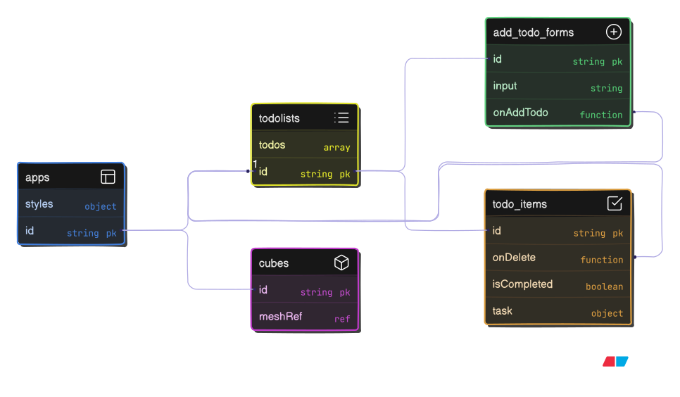

## Component Tree + Data Flow

**Explanation**:  
- `App` stores styles and passes data further.  
- `TodoLists` manages the `todos` array.  
- `AddTodoForm` receives the `onAddTodo` function to add new items.  
- `TodoItem` has a locate state `isCompleted` and receives `task` and `onDelete` via `props`.  
- `Cubes` works with `meshRef` (3D visualization).  
